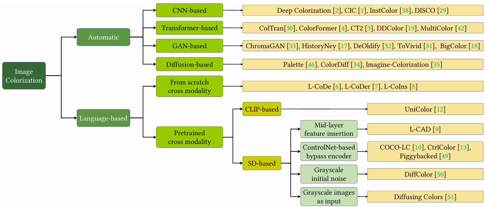
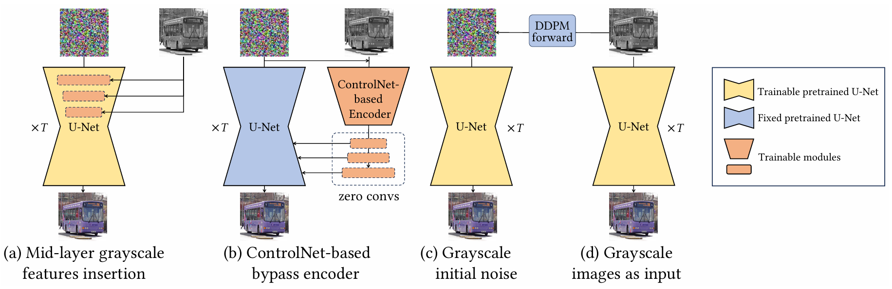
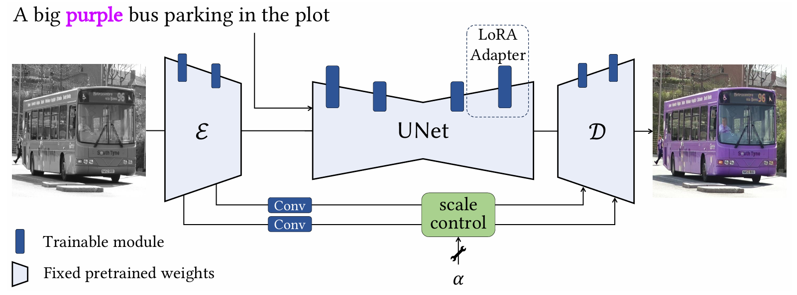
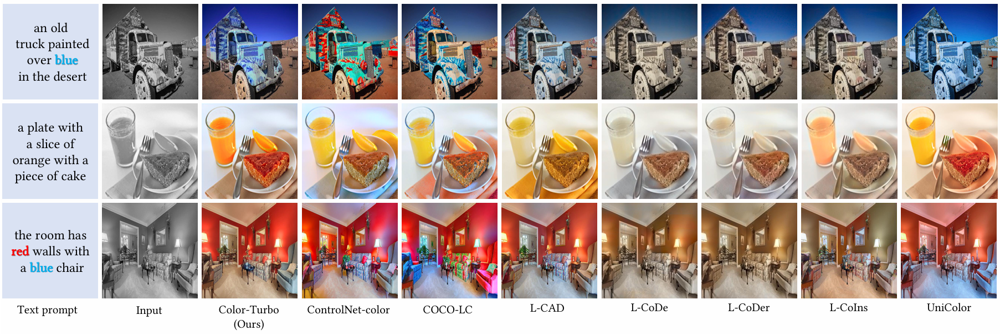

# Language-based Image Colorization: A Benchmark and Beyond

#### TODO:
- [x] Upload arXiv paper
- [ ] Release evaluation protocal 
- [ ] Release code of Color-Turbo
- [ ] Release online demo of Color-Turbo

**Outline:**
- [Review and Benchmark](#book-review-and-benchmark)
    - [Automatic Image Colorization](#automatic-image-colorization)
        - [CNN-based methods](#cnn-based-methods)
        - [Transformer-based methods](#transformer-based-methods)
        - [GAN-based methods](#gan-based-methods)
        - [Diffusion-based methods](#diffusion-based-methods)
    - [Language-based Image Colorization](#language-based-image-colorization)
        - [From-scratch cross-modality](#from-scratch-cross-modality)
        - [CLIP-based cross-modality](#clip-based-cross-modality)
        - [Stable-Diffusion based cross-modality](#stable-diffusion-based-cross-modality)
            -[Four Representative Condition Insertion Paradigm](#four-representative-condition-insertion-paradigm)
- [Color-Turbo: Single-step Diffusion for Colorfulness Controllable Colorization](#rocket-color-turbo-single-step-diffusion-for-colorfulness-controllable-colorization)

<!-- [toc] -->

## :book: Review and Benchmark

### Automatic Image Colorization
The most straightforward ones, however limited by poor controllability.
#### CNN-based methods:

| Title | Abbr. | Feature | Code | Pub. & Date
|:-----:|:-----:|:-----:|:-----:|:-----:|
|[Deep Colorization](https://ieeexplore.ieee.org/document/7410412)| - | the first time CNN-based recolor model| - | CVPR, 2015|
|[Colorful Image Colorization](https://link.springer.com/chapter/10.1007/978-3-319-46487-9_40) | CIC | classification loss for more saturated colors | [code](https://github.com/richzhang/colorization) | ECCV, 2016|
|[Instance-aware Image Colorization](http://openaccess.thecvf.com/content_CVPR_2020/papers/Su_Instance-Aware_Image_Colorization_CVPR_2020_paper.pdf)| InstColor | Involving object bounding boxes as auxiliary priors | [code](https://github.com/ericsujw/InstColorization) | CVPR, 2020 |
|[Disentangled Image Colorization via Global Anchors](https://dl.acm.org/doi/10.1145/3550454.3555432) | DISCO | spatial coarse-to-fine model | [code](https://github.com/MenghanXia/DisentangledColorization) | SIGGRAPH Asia 2022 |

#### Transformer-based methods:
| Title | Abbr. | Feature | Code | Pub. & Date
|:-----:|:-----:|:-----:|:-----:|:-----:|
|[Colorization Transformer](https://arxiv.org/abs/2102.04432) | ColTran | spatial coarse-to-fine model | [code](https://github.com/google-research/google-research/tree/master/coltran) | ICLR, 2021|
|[ColorFormer: Image Colorization via Color Memory assisted Hybrid-attention Transformer](https://www.ecva.net/papers/eccv_2022/papers_ECCV/papers/136760020.pdf) | ColorFormer | enhanced model design | [code](https://github.com/jixiaozhong/ColorFormer) | ECCV, 2022 |
|[CT2: Colorization Transformer via Color Tokens](https://ci.idm.pku.edu.cn/Weng_ECCV22b.pdf) | CT2 | learnable color tokens | [code](https://github.com/shuchenweng/CT2) | ECCV 2022 |
|[DDColor: Towards Photo-Realistic and Semantic-Aware Image Colorization via Dual Decoders](https://openaccess.thecvf.com/content/ICCV2023/papers/Kang_DDColor_Towards_Photo-Realistic_Image_Colorization_via_Dual_Decoders_ICCV_2023_paper.pdf) | DDColor | query-based transformer | [code](https://github.com/piddnad/DDColor) | ICCV, 2023|
|[MultiColor: Image Colorization by Learning from Multiple Color Spaces](https://dl.acm.org/doi/10.1145/3664647.3680726) | MultiColor | extend DDColor with multiple color spaces | (No Code/project page) | ACM MM 2024 |

#### GAN-based methods:
| Title | Abbr. | Feature | Code | Pub. & Date
|:-----:|:-----:|:-----:|:-----:|:-----:|
|[DeOldify](https://github.com/jantic/DeOldify) | DeOldify | asynchronous GAN training | [code](https://github.com/jantic/DeOldify) | Github project, 2018 |
| [ChromaGAN: Adversarial Picture Colorization with Semantic Class Distribution](http://openaccess.thecvf.com/content_WACV_2020/papers/Vitoria_ChromaGAN_Adversarial_Picture_Colorization_with_Semantic_Class_Distribution_WACV_2020_paper.pdf) | ChromaGAN | classification-based GAN loss| [code](https://github.com/pvitoria/ChromaGAN) | WACV, 2020 |
|[Focusing on Persons: Colorizing Old Images Learning from Modern Historical Movies](https://dl.acm.org/doi/10.1145/3474085.3481544) | HistoryNet | dataset and recolor old films | [code](https://github.com/BestiVictory/MHMD) | ACM MM, 2021 |
|[Towards Vivid and Diverse Image Colorization with Generative Color Prior](https://openaccess.thecvf.com/content/ICCV2021/papers/Wu_Towards_Vivid_and_Diverse_Image_Colorization_With_Generative_Color_Prior_ICCV_2021_paper.pdf) | ToVivid (GCP-Colorization)| GAN inversion | [code](https://github.com/ToTheBeginning/GCP-Colorization) | ICCV, 2021 |
|[BigColor: Colorization using a Generative Color Prior for Natural Images](https://link.springer.com/chapter/10.1007/978-3-031-20071-7_21) | BigColor | pretrained BigGAN w/o inversion | [code](https://github.com/KIMGEONUNG/BigColor) | ECCV, 2022 |

#### Diffusion-based methods:
Most of the following method can establish an intuitive bridge with text prompts by virtue of diffusion models.
| Title | Abbr. | Feature | Code | Pub. & Date
|:-----:|:-----:|:-----:|:-----:|:-----:|
|[Palette: Image-to-image diffusion models](https://dl.acm.org/doi/10.1145/3528233.3530757) | Palette | retrained diffusion for linear degradtion| [code](https://diffusion-palette.github.io/) (No Code) | SIGGRAPH, 2022 |
|[Multimodal semantic-aware automatic colorization with diffusion prior](https://arxiv.org/abs/2404.16678) | ColorDiff | segmentation maps as additional prior | [code](https://github.com/servuskk/ColorDiff-Image) | arXiv, 24.04 |
|[Automatic Controllable Colorization via Imagination](https://openaccess.thecvf.com/content/CVPR2024/papers/Cong_Automatic_Controllable_Colorization_via_Imagination_CVPR_2024_paper.pdf) | Imagine-Colorization | Ensembled pretrained ControlNet | [code](https://github.com/xy-cong/imagine-colorization) (No Code) | CVPR, 2024 |

### Language-based Image Colorization
The core challenge is to construct an accurate **cross-modal correspondence** between grayscale images and color texts.
#### From-scratch cross-modality:
| Title | Abbr. | Feature | Code | Pub. & Date
|:-----:|:-----:|:-----:|:-----:|:-----:|
 [L-CoDe: Language-based Colorization using Color-object Decoupled Conditions](https://cdn.aaai.org/ojs/20170/20170-13-24183-1-2-20220628.pdf) | L-CoDe | Dense human annotation & two-stage alignment | [code](https://github.com/changzheng123/L-CoDe) | AAAI, 2022 |
|[L-CoDer: Language-based Colorization with Color-object Decoupling Transformer](https://link.springer.com/chapter/10.1007/978-3-031-19797-0_21) | L-CoDer | Dense human annotation & two-stage alignment & BERT for text embedding | [code](https://github.com/changzheng123/L-CoDer) | ECCV, 2022 |
|[L-CoIns: Language-based Colorization with Instance Awareness](https://openaccess.thecvf.com/content/CVPR2023/papers/Chang_L-CoIns_Language-Based_Colorization_With_Instance_Awareness_CVPR_2023_paper.pdf) | L-CoIns | adaptive alignment & luminance augmentation | [code](https://github.com/changzheng123/L-CoIns) | CVPR, 2023 |

#### CLIP-based cross-modality:
| Title | Abbr. | Feature | Code | Pub. & Date
|:-----:|:-----:|:-----:|:-----:|:-----:|
|[UniColor: A Unified Framework for Multi-Modal Colorization with Transformer](https://arxiv.org/abs/2209.11223) | UniColor | sliding window alignment based on CLIP | [code](https://github.com/luckyhzt/unicolor) | SIGGRAPH Asia, 2022 |

#### Stable-Diffusion based cross-modality:
##### Four Representative Condition Insertion Paradigm

| Title | Abbr. | Feature | Code | Pub. & Date
|:-----:|:-----:|:-----:|:-----:|:-----:|
|[Improved Diffusion-based Image Colorization via Piggybacked Models](https://arxiv.org/abs/2304.11105) | Piggybacked-Color | trainable copy of full U-Net for fine-tune | [project](https://piggyback-color.github.io/) (No Code) | arXiv, 23.04 |
|[DiffColor: Toward High Fidelity Text-Guided Image Colorization with Diffusion Models](https://arxiv.org/pdf/2308.01655)| DiffColor | contrasitive CLIP guidance | (No Code/project page) | arXiv, 23.08 |
|[Control Color: Multimodal Diffusion-based Interactive Image Colorization](https://arxiv.org/abs/2402.10855) | CtrlColor | ControlNet-based multi-modal condition| [code](https://github.com/ZhexinLiang/Control-Color) | arXiv 24.02 |
|[Diffusing Colors: Image Colorization with Text Guided Diffusion](https://arxiv.org/abs/2312.04145) | Diffusing Colors | rescheduled diffusion model with varied saturation | [project](https://aharonazulay.github.io/project_page_colorization/) (No Code) | SIGGRAPH Asia, 2023|
|[L-CAD: Language-based Colorization with Any-level Descriptions using Diffusion Priors](https://proceedings.neurips.cc/paper_files/paper/2023/file/f3bfbd65743e60c685a3845bd61ce15f-Paper-Conference.pdf) | L-CAD | finetune SD & bypassed VAE | [code](https://github.com/changzheng123/L-CAD) | NeurIPS, 2023 |
|[COCO-LC: Colorfulness Controllable Language-based Colorization](https://dl.acm.org/doi/10.1145/3664647.3680662) | COCO-LC | coarse-to-fine ControlNet-based & colorfulness control | [code](https://github.com/lyf1212/COCO-LC/) | ACM MM, 2024 |

---

## :rocket: Color-Turbo: Single-step Diffusion for Colorfulness Controllable Colorization

**TL;NR**: Highly efficient LoRA-finetuned SD with GAN loss, taking gray images as input to recolor in one step. Colorfulness is controlled by a flexible scaling factor. Skip connection is established for more precise details preserved.

###### :stopwatch: The implementation will be released upon publish.
